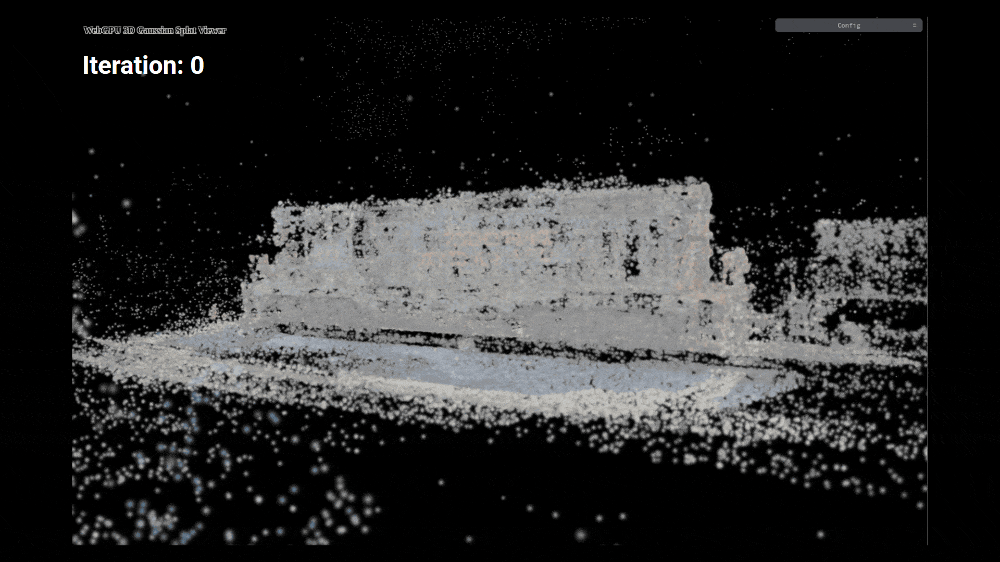
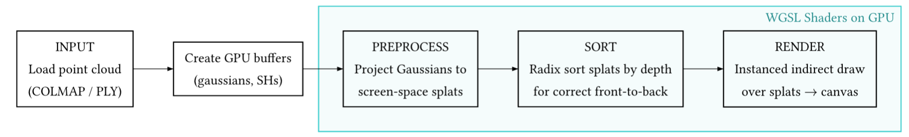

# Skyfall-Viewer
3D Gaussian Splat viewer and reconstruction pipeline in WebGPU.

## Abstract

This repository contains an interactive viewer and a 3D Gaussian Splat (3DGS) reconstruction pipeline in WebGPU. The implementation loads a point cloud (COLMAP / PLY) and a set of 2D images, and it performs iterative training of per-splat parameters using tiled forward/backward passes and an Adam optimizer implemented on the GPU.

## Demo

<div style="text-align:center;">
	
</div>

## Rendering Pipeline

<div style="text-align:center;">
	
</div>

---

Screen-space 2D Gaussian evaluation (given pixel offset d and conic params a,b,c):

$$s = \tfrac{1}{2}\left(a\,d_x^2 + 2b\,d_x d_y + c\,d_y^2\right)$$
$$G(d) = \exp\bigl(-s\bigr)$$

Alpha compositing (front-to-back accumulative used in shaders):

Let per-splat alpha contribution be $\alpha_{splat} = opacity\cdot G(d)$ and
$C_{splat} = color\cdot \alpha_{splat}$. The incremental compositing for pixel p updates:

$$C \leftarrow C + C_{splat} \cdot (1 - A)$$
$$A \leftarrow A + \alpha_{splat} \cdot (1 - A)$$

Final pixel color: $C_{final} = C + (1 - A)\cdot C_{bg}$

## Reconstruction Pipeline

<div style="text-align:center;">
	
</div>

---

Training as a machine-learning optimization over per-gaussian parameters $\theta = \{\mu, q, \sigma, \ell, c_{SH}\}$ where:
- $\mu$ : Gaussian center (3D)
- $q$ : rotation quaternion (4D)
- $\sigma$ : per-axis scale (3D)
- $\ell$ : opacity logit (scalar)
- $c_{SH}$ : spherical harmonic coefficients (per-gaussian color basis)

### Forward (tiled)

For each pixel $p$ the tiled forward pass computes
- per-splat Gaussian weight: $G_p(g) = \exp\left(-\frac{1}{2} d^T A_g d\right)$ where $A_g$ is the 2×2 screen-space conic derived from the 3D covariance.
- per-splat opacity after nonlinearity: $\alpha_g = \sigma(\ell_g) \in (0,1)$ where $\sigma$ is sigmoid applied to stored logit.
- splat contribution to pixel: $\alpha_{g,p} = \min(\alpha_g\,G_p(g),\,\alpha_{max})$ and
    the front-to-back compositing uses $C_p \leftarrow C_p + color_g(\text{dir})\cdot(\alpha_{g,p}\,(1- A_p))$.

### Training loss
The loss (error between _predicted projection_ and _target image_) used is a combined $L2 + L1$ on colors per-pixel. Shader implements gradients directly:

> Let $r_p = I_{pred,p} - I_{tgt,p}$. The per-pixel gradient w.r.t. predicted color is:
>
> $$\nabla_{I_{pred,p}} L = w_{L2} \cdot r_p + w_{L1} \cdot \mathrm{sgn}(r_p)$$


### Backward (tiled)
Computes gradients w.r.t. SH coefficients and opacity logit.

Let $res_p$ be the residual gradient from the loss shader for pixel p.

The tiled backward multiplies $res_p$ by the splat's compositing weight contribution

$$res_{\mathrm{scaled}} = res_p \cdot (\alpha_{g,p}\,(1-A_p))$$

SH gradient accumulation (per-coefficient):

$$\frac{\partial L}{\partial c_{SH,g,k}} = \sum_{p\in\Omega_g} res_{p} \cdot (\alpha_{g,p}\,(1-A_p)) \cdot Y_k(\mathbf{v})$$

where $Y_k(\mathbf{v})$ are the evaluated SH basis functions for view direction $\mathbf{v}$ and $\Omega_g$ is the set of pixels intersected by gaussian $g$ in the tiling.

Opacity logit gradient: the shader computes an intermediate scalar

$$dL/d\alpha_{splat} = (\langle res_p, color_{g}(v) \rangle - \langle res_p, C_{bg}\rangle)\cdot(1-A_p)$$

then uses the chain rule for the sigmoid logit $\ell_g$:

$$\frac{\partial L}{\partial \ell_g} = dL/d\alpha_{splat} \cdot \alpha_{g,p} \cdot (1 - \alpha_{g})$$

The shader accumulates `grad_opacity[g] += dL/d\ell_g` and also writes a quantized contribution to an atomic integer `grad_alpha_splat[g]` (scaled fixed-point) used by the geometry backward pass.

### Backward (geometry)
Computes parameter gradients for 3D geometry (position $\mu$, log-scale $\log\sigma$, quaternion $q$).

The geometry backward reads the accumulated `grad_alpha_splat[g]` and converts to float $v_{\alpha}$. It recovers a scalar multiplier that weights the derivative of the visibility term.

The shader constructs the per-gaussian anisotropic matrix $C_{3D} = (S R)^T (S R)$ where $S=\mathrm{diag}(1/\sigma)$ and $R$ is rotation from quaternion. It computes

- transformed ray and center quantities and an effective squared-distance $d_{\perp}^2$ between ray and gaussian ellipsoid projection,
- visibility $vis = \exp(-\frac{1}{2}d_{\perp}^2)$,
- then uses analytic vector-Jacobian-products (VJPs) to backpropagate through the transform and quaternion-parameterization.

### Adam optimizer
Shader implements a per-element Adam update:

$$m_t = \beta_1 m_{t-1} + (1-\beta_1) g_t$$
$$v_t = \beta_2 v_{t-1} + (1-\beta_2) g_t^2$$
$$\hat{m}_t = m_t / (1-\beta_1^t),\quad \hat{v}_t = v_t / (1-\beta_2^t)$$
$$\theta_t = \theta_{t-1} - \alpha \frac{\hat{m}_t}{\sqrt{\hat{v}_t} + \epsilon}$$

### Pruning & Densification

**Prune:** Simple threshold on learned opacity. Each gaussian's logit is converted to opacity via sigmoid and kept if

$$\sigma(\ell_g) \ge \tau_{prune}$$

Implementation: per-thread compute checks `sigmoid(p02.y)` and atomically writes surviving gaussians into compacted output buffers.

**Densify:** Split or clone gaussians where the current projected size is too large relative to a target density and where color reconstruction error is high.

New gaussians are emitted into output buffers via atomic counters and can be merged into the main buffers by the renderer after the densify pass completes.

## Tile-based depth sorting
The Gaussian splat viewer features **tile-based depth sorting**, which improves rendering performance on large point clouds by organizing Gaussian splats into screen-space tiles and sorting per-tile, reducing memory bandwidth and improving cache locality.

<table>
  <tr>
    <td></td>
    <td></td>
  </tr>
</table>

Implementation: a compute-based pipeline that:
1. For each Gaussian, determines which tiles it overlaps using its 2D projection and splat radius.
2. Generates key-value pairs `(tile_id | depth, gaussian_id)` for each Gaussian-tile intersection using atomic operations to avoid write conflicts.
3. Sorts these pairs globally using radix sort.
4. Identifies start/end ranges for each tile via a second compute pass.
5. During rendering, tiles can be rasterized in any order with per-tile depth ordering.

Trade-offs: This approach reduces per-frame fragment shader overdraw in theory but adds preprocessing overhead. For scenes with significant depth complexity and overlapping splats per tile, this can improve performance. For scenes with sparse or well-distributed splats, the overhead may outweigh the benefits.

## Build instructions

1) Download [Node.js](https://nodejs.org/en/download)

2) Clone repository
    ```cmd
    git clone https://github.com/krispy-kenay/Skyfall-Viewer.git
    ```

3) Install dependencies
    ```cmd
    cd Skyfall-Viewer
    npm install
    ```

3) Launch dev server
    ```cmd
    npm run dev
    ```
    Optional build to static `dist/`
    ```cmd
    npm run build
    ```

4) Open the page in a Chromium-based browser with WebGPU enabled (e.g. [Chrome Canary](https://www.google.com/chrome/canary/)). The UI can load a dataset via folder picker.

## References & Acknowledgements

[B. Kerbl, G. Kopanas, T. Leimkühler, and G. Drettakis, ‘3D Gaussian Splatting for Real-Time Radiance Field Rendering’, _ACM Transactions on Graphics_, vol. 42, no. 4, July 2023](https://repo-sam.inria.fr/fungraph/3d-gaussian-splatting/)

[J.-Y. Lee _et al._, ‘Skyfall-GS: Synthesizing Immersive 3D Urban Scenes from Satellite Imagery’, _arXiv preprint_, 2025.](https://skyfall-gs.jayinnn.dev/)

[B. Mildenhall, D. Verbin, P. P. Srinivasan, P. Hedman, R. Martin-Brualla, and J. T. Barron, ‘MultiNeRF: A Code Release for Mip-NeRF 360, Ref-NeRF, and RawNeRF’. 2022.](https://github.com/google-research/multinerf)

